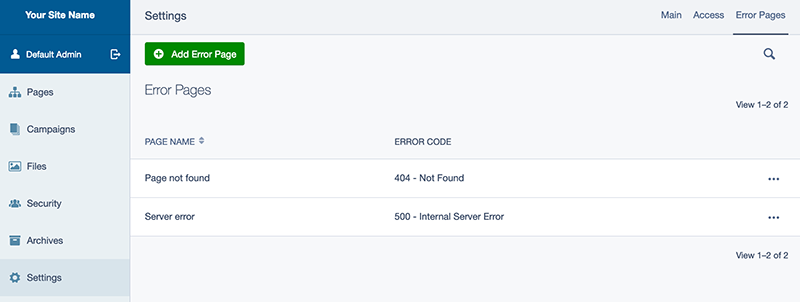

# silverstripe-errorpagesconfig

A SilverStripe module to move `ErrorPage`s out of the cms tree and into their own grid field in CMS Settings area.

It also updates `ErrorPage` `$summary_fields` to show the associated error code of the page.

MultiSites-compatible: If the [symbiote/silverstripe-multisites](https://github.com/symbiote/silverstripe-multisites) module is present, the error pages grid field is added to each `Site`, rather than onto the global `SiteConfig` object.

## Requirements

SilverStripe 4

## Installation

`composer require fromholdio/silverstripe-errorpagesconfig`

That's really about it. Intended to be very plug-n-play.

## Screenshot

After installing, your error pages should disappear from the CMS tree view, and you'll have the following gridfield in your CMS Settings area (or on your `Site` page objects if `symbiote/silverstripe-multisites` is also present). 

